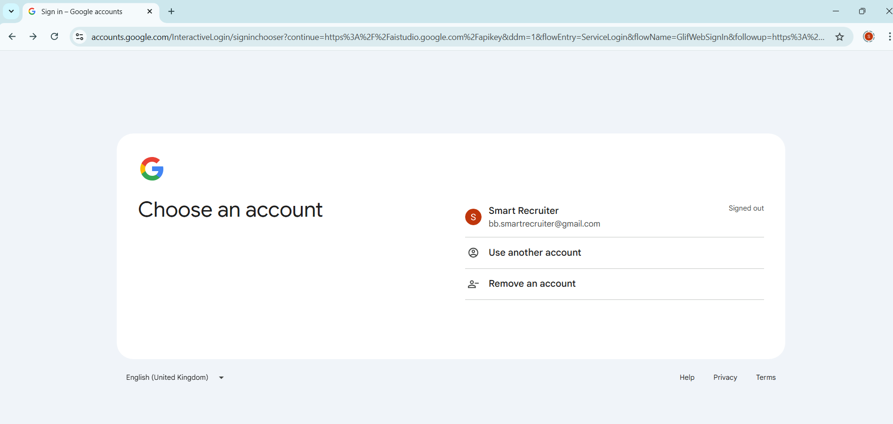
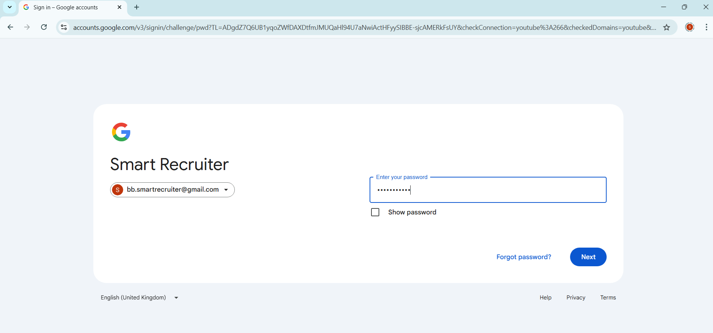
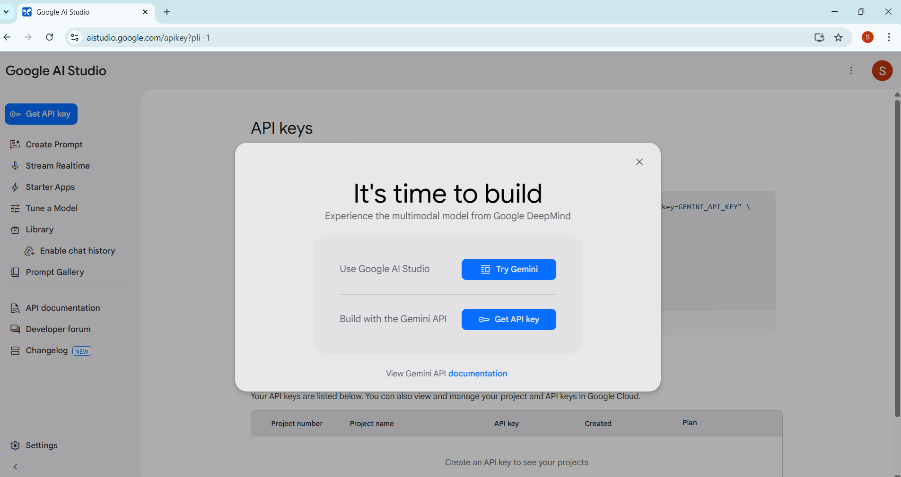
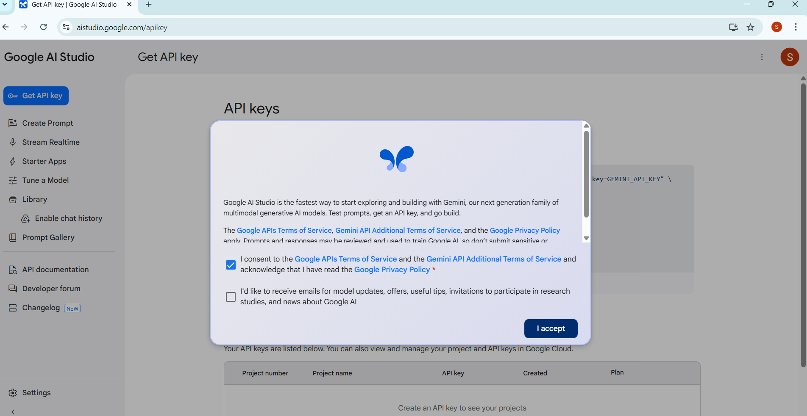
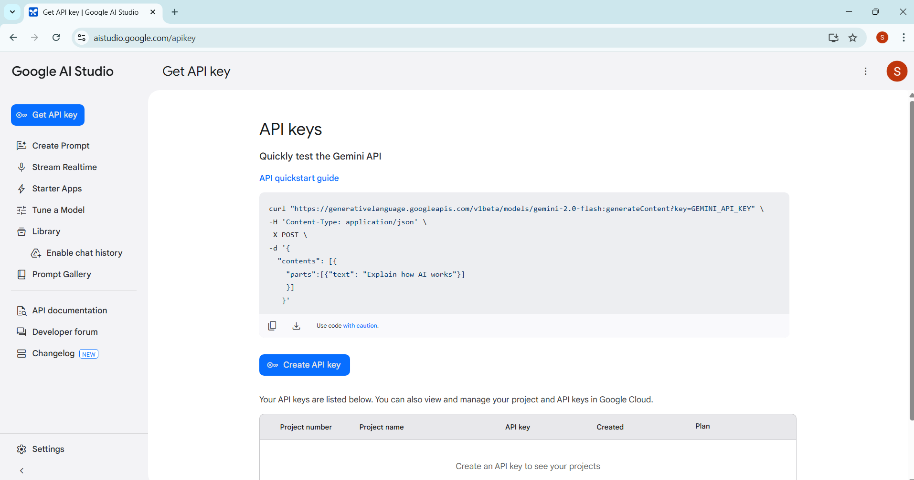
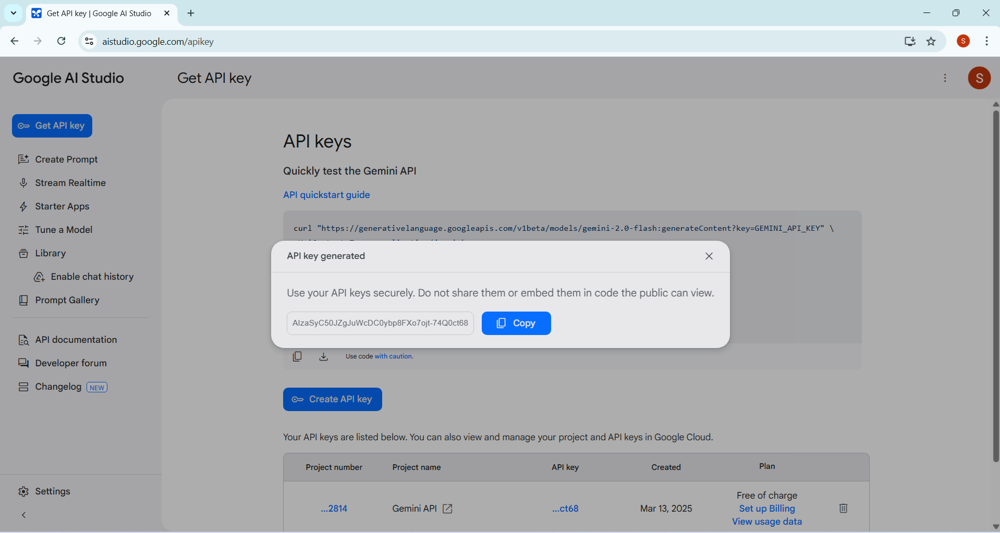
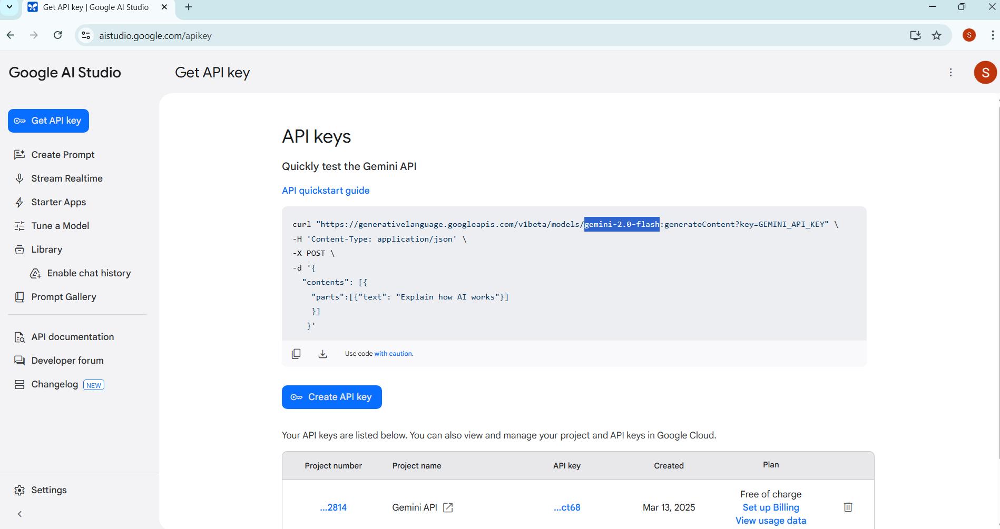

# Setting Up Gemini API Key and Model Name

To use **AI Smart Resume Match**, you need to configure the **Gemini API Key** and **Model Name**. Follow the steps below to set up these dependencies.

---

## 1. Create a Gemini API Key

The **Gemini API Key** is required for authentication with the Gemini AI service. Here’s how to create one:

### Step 1: Sign in to Google AI Studio and Create an API Key
1. Go to [Google AI Studio](https://aistudio.google.com/apikey).
2. Sign in with your Google account.

3. Enter your Google account password.

4. After Successful Google account Sign in. You will get below screen then click on **Get API Key** button.

5. After you get below screen then select **I consent to the Google APIs Terms of Service ...** and then click **I accept** button.

6. Then you will get **Google AI Studio Get API Key** screen then click **Create API key** button.

7. Then you will get **API key generated** screen then copy **API key** and save in secure place.

8. Then copy **Gemini Model Name**, in my case `gemini-2.0-flash` and save in secure place.

